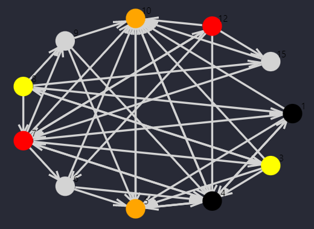

- [Kidney exchange program](#kidney-exchange-program)
  * [Environment](#environment)
  * [Organization](#organization)

# Kidney exchange program

Kidney exchange is nowaday a big issue. Several people suffer from kidney problem and need transplants.
We propose here an approach to this problem through the framework of stochastic optimization.
This repository has been made within our "Optimization under uncertainty" course given by Jeremy Omer at INSA Rennes.

We chose to treat the problem as following : our goal is to make groups of people (cluster) which are linked together. Within these groups the crossed tests will be proceeded and then after these tests we will create cycles to proceed the real exchange.



## Environment

To execute the different files from this repository you will need several packages.
If you execute the following command in your terminal, at the root of this rep :

```{command line}
julia requirements.jl
```

All the packages will be installed, and then you will be able te execute all the scripts.


## Organization


This repository contains multiple folders :

- `src\sotchastic_framework` : this folder contains all the methods implemented to solve the stochastic problem
- `src\deterministic_framework` : this folder contains some implementation for the deterministic version of the problem.
- `notebook` : this folder contains the notebook for our final evaluation
- `utils` : this folder contains all the function for the secondary tasks such as read and process the data, plot the graphs, ...

## CONTENT

### DETERMINISTIC VERSION

Our first idea for this problem was to think only about cycles. We adopt the philosophy that we select cycles and we only perform the cross-tests among the cycles we have selected.

Thus, we define the following data:

- $C_K$ : the set of cycles of length at most $K$.
- $C_K(i)$ : the set of cycles of length at most $K$, which contain the vertex $i$.
- $\forall c \in C_K \quad w_c$ : denote the utility of cycle $c$.
- $omega~\in~\Omega$ : defines a realization of the uncertainties. We will also speak of a scenario. It is a possible realization of the hazard that weighs on the different arcs.
- $\forall ~c~\in C_K\quad \xi_c(\omega) \in \{0, 1\} = 1$ : if and only if we cannot select the cycle $c$ (the tests are bad) for the scenario $\omega$

We define the following variables

- $1^{er}$ level : $\forall c \in C\quad x_c \in \{0, 1\} = 1$ if and only if, we decide to select the cycle $c$.
- recourse: $\forall c \in C\quad y_c(\omega) \in \{0, 1\} = 1$ one cannot select the cycle $c$ in the scenario $\omega$

The problem can be modeled as follows:


$$
\begin{equation}
	(\mathbb{CRP}) := \left\{\begin{aligned}
        \underset{x}{\min} \quad & - \sum_{c \in C_K} x_cw_c +\mathbb{E}_{\omega}\left(\underset{y}{\min} \left[\sum_{c \in C_K} y_c(\omega)w_c\right]\right)\\
         s.c \quad &\sum_{c\in C_K(i)}x_c\leq 1~\forall i \in V\\ % contrainte déterministe
         % les contraintes stochastiques
         & y_c(\omega) = \xi_c(\omega)~x_c\quad \forall c \in C_K \quad \forall \omega \in \Omega\\ 
         & x_c \in \{0,1\} \quad \forall c \in C_K\\
         & y_c(\omega) \in \{0,1\} \quad \forall c \in C_K\quad \forall \omega \in \Omega
	\end{aligned}\right.
\end{equation}
$$

Which is equivalent to :


Thus we note $tilde{w}_c = w_c \times \mathbb{P}\{\xi_c(\omega) = 0\}$, the new utility of a cycle which will be in fact a combination between the real utility of the cycle $w_c$ and the probability that this last one is realized. 

We finally have the following problem:

$$
\begin{equation}
	(\mathbb{CRP}) := \left\{\begin{aligned}
        \underset{x}{\max} \quad & \sum_{c \in C_K} x_c\hat{w}_c\\
         s.c \quad &\sum_{c\in C_K(i)}x_c\leq 1~\forall i \in V\\ % contrainte déterministe
         & x_c \in \{0,1\} \quad \forall c \in C_K\\
	\end{aligned}\right.
\end{equation}
$$

## STOCHATIC VERSION

The cross-test for the $\omega$ scenario are finally summarized in the variable $\xi_{i,j}(\omega)$, which is a binary variable, which is worth $1$ if the test between vertex $i$ and vertex $j$ is successful. Let's move on to the modeling.

We will consider the variables:

- 1st level: $\forall (i,j) \in V\times V\quad x_{i,j} \in \{0,1\} = 1$ if $i$ and $j$ are in the same group.
- recourse: $\forall c \in C_K \quad y_c(\omega) \in \{0,1\}=1$ if we decide to choose the cycle $c$ to carry out the exchanges in the scenario $\omega$.

We define the *cluster problem* ($\mathbb{CP}$) as follows:

Translated with www.DeepL.com/Translator (free version)

$$
\begin{equation}
	\mathbb{CP}:= \left\{\begin{aligned}
        \underset{x}{\max} &\quad \mathbb{E}_{\omega}\left[\underset{y}{\max}\sum_{c \in C_K}y_c(\omega) w_c\right]\\
         s.c &\quad x_{i,j} = x_{j,i}\quad \forall (i,j) \in V\times V\\
         &\quad x_{i,j} + x_{j,k} -1 \leq x_{i,k} \quad \forall (i,j,k) \in V\times V\times V\\
         &\quad \sum_{j \in V} x_{i,j} \leq U \quad \forall i \in V \\
         &\quad y_c(\omega) \leq x_{i,j}\xi_{i,j}(\omega) \quad \forall c \in C_k, ~\forall (i,j) \in c,~ \forall \omega \in \Omega \\
         &\quad \sum_{c \in C_K(i)} y_c(\omega) \leq 1 \quad \forall i \in V,\quad\forall \omega \in \Omega\\
	\end{aligned}\right.
\end{equation}
$$


## STOCHATIC VERSION TACKING INTO ACCOUNT THE RISK

$$
\begin{equation}
	\mathbb{RACP}:= \left\{\begin{aligned}
        \underset{x,t}{\min} &\quad t + \frac{1}{1-\alpha}\mathbb{E}_{\omega}\left[\left(\underset{y}{\min}\left( - \sum_{c \in C_K}y_c(\omega) w_c\right) - t\right)+\right]\\
         s.c &\quad x_{i,j} = x_{j,i}\quad \forall (i,j) \in V\times V\\
         &\quad x_{i,j} + x_{j,k} -1 \leq x_{i,k} \quad \forall (i,j,k) \in V\times V\times V\\
         &\quad \sum_{j \in V} x_{i,j} \leq U \quad \forall i \in V \\
         &\quad y_c(\omega) \leq x_{i,j}\xi_{i,j}(\omega) \quad \forall c \in C_k, ~\forall (i,j) \in c,~ \forall \omega \in \Omega \\
         &\quad \sum_{c \in C_K(i)} y_c(\omega) \leq 1 \quad \forall i \in V,\quad\forall \omega \in \Omega\\
	\end{aligned}\right.
\end{equation}
$$